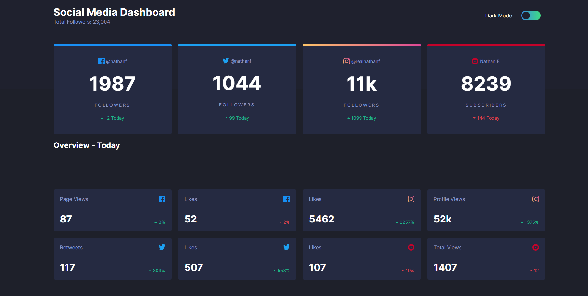

# 📊 Social Media Dashboard

Un proyecto de FrontendMentor de maquetación e implementación de temas, basado en un Dashboard interactivo de redes sociales. Incluye persistencia del tema usando LocalStorage. 

## 🌐 Demo en Vivo

**¡Prueba la aplicación aquí!** 👉 [Ver Demo](https://social-media-dashboard-frontendment.vercel.app/)


## 🚀 Características

- **Tema adaptable**: Switch entre modo claro y oscuro con persistencia en localStorage
- **Diseño responsive**: Adaptable a todos los dispositivos usando CSS Grid
- **Accesibilidad**: Atributos ARIA y navegación por teclado

## 🛠️ Tecnologías

- **HTML5**: Estructura semántica con landmarks y atributos ARIA
- **CSS3**: Variables CSS, Grid Layout, Flexbox
- **JavaScript**: Vanilla JS con localStorage para persistencia del tema
- **Fuentes**: Inter (Google Fonts) 

## 📱 Responsive Design

- **Desktop**: Layout de 4 columnas con CSS Grid
- **Tablet**: Adaptación a 2 columnas para pantallas medianas
- **Mobile**: Diseño de 1 columna optimizado para móviles

## 🎨 Modo Oscuro

- Switch toggle con animación suave
- Persistencia automática en localStorage
- Transiciones fluidas entre temas

## 🚀 Instalación

1. Clona el repositorio:
```bash
git clone https://github.com/JesusAlarconDev/Social-Media-Dashboard-frontendmentor.git
```

2. Abre `index.html` en tu navegador

3. ¡Listo! El dashboard está funcionando

## 📁 Estructura del Proyecto

```
social-media-dashboard/
├── index.html          # Estructura principal
├── styles/
│   ├── main.css       # Estilos principales y tema oscuro
│   └── grid.css       # Sistema de grid responsive
├── scripts/
│   └── code.js        # Lógica del tema y localStorage
├── images/            # Iconos SVG de redes sociales
└── fonts/             # Fuente Inter
```

## 🔧 Características Técnicas

- **CSS Grid**: Layout principal con áreas nombradas para fácil mantenimiento
- **localStorage**: Persistencia del tema seleccionado
- **Variables CSS**: Sistema de colores centralizado y fácil de modificar
- **Media Queries**: Breakpoints en 1100px y 730px

## 📸 Capturas de Pantalla



## 🌟 Desafíos y Aprendizajes

- Implementación de CSS Grid para layouts complejos
- LocalStorage para persistencia del tema al recargar la página
- Diseño responsive 
- Optimización de accesibilidad con atributos ARIA

## 📄 Licencia

Este proyecto es de código abierto y está disponible bajo la licencia MIT.

## 👨‍💻 Autor

**Jesús Alarcón Maldonado** - [GitHub](https://github.com/JesusAlarconDev)

---

*Challenge de [Frontend Mentor](https://www.frontendmentor.io)*
